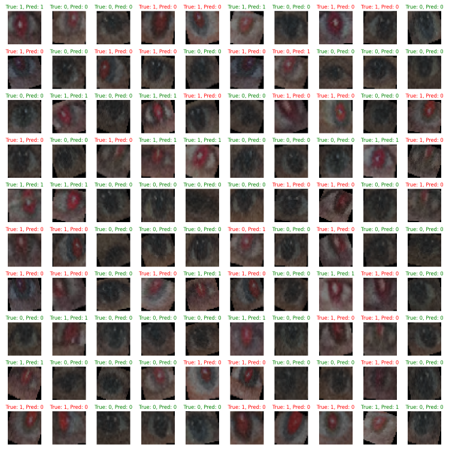

# Red eye effect classifier

The goal of the assignment is to create a classifier of human eye images which will distinguish images with the red-eye effect.

You can run the inference of the trained model on [🤗 Hugging Face - RedEyeClassifier](https://huggingface.co/spaces/nssharmaofficial/RedEyeClassifier).

## Contents

1. [Environment setup](#environment-setup)
1. [Dataset](#dataset)
1. [Model](#model)
1. [Training and evaluation](#training-and-evaluation)

## File structure

```text
Red-eye-effect-classification
├── data/
├── dataset_output_images/
├── checkpoints/
├── training_output_images/
├── config.py
├── dataset.py
├── model.py
├── train.py
├── Dockerfile
├── README.md
├── readme_images/
└── requirements.txt
```

## Environment setup

You can pull the Docker image from [Docker hub](https://hub.docker.com/repository/docker/nssharma/red-eye-effect-classification/tags):

```bash
docker pull nssharma/red-eye-effect-classification:v1
```

Or you can also build a Docker image locally:

```bash
docker build -t nssharma/red-eye-effect-classification:v1 -f Dockerfile .
```

To run a Docker container:

```bash
docker run --gpus device=0 -it --entrypoint bash -p 8888:8888 -v "$(pwd)":/red-eye-effect-classifier nssharma/red-eye-effect-classification:v1
```

## Dataset

The training and test images are saved in folder `data`.

The dataset contains:

- 80 `normal` training images (label = 0)
- 20 `red` training images (label = 1)
- 50 `normal` test images (label = 0)
- 50 `red` test images (label = 1)

The [`dataset.py`](/dataset.py) script handles the loading, transforming, and batching of images. Running it sets up the dataset paths, creates a custom dataset and data loader with transformations and visualizes some batches of images by saving them to the `dataset_output_images` directory.

 

You can preview and/or download the images from [🤗 Hugging Face - red-eye-effect dataset](https://huggingface.co/datasets/nssharmaofficial/red-eye-effect).

## Model

The CNN is structured with four convolutional layers followed by two fully connected layers. Each convolutional layer is paired with batch normalization and a LeakyReLU activation function. A dropout layer is included before the final fully connected layer to reduce the risk of overfitting.

It has 52042 trainable parameters and the architecture is as follows:

```text
Original:  torch.Size([8, 3, 32, 32])
Conv1:  torch.Size([8, 8, 16, 16])
Conv2:  torch.Size([8, 16, 8, 8])
Conv3:  torch.Size([8, 32, 4, 4])
Conv4:  torch.Size([8, 64, 2, 2])
OutConv:  torch.Size([8, 256])
Lin1:  torch.Size([8, 32])
Lin2:  torch.Size([8, 2])
```

The [`model.py`](/model.py) contains the definition of a CNN designed to classify images into `normal` and `red` eye categories. Running it initializes the setup, loads the datasets, creates a DataLoader, and then instantiates the CNN model. It prints the number of trainable parameters and the input and output size for a batch of images.

## Training and evaluation

To start training the model, run the [`train.py`](/train.py) script.

We implemented [learning rate gradual warmup](https://arxiv.org/pdf/1706.02677). Gradual warmup is a technique used to improve the stability of the training process by slowly increasing the learning rate from a small value to a target value over a specified number of epochs. In this project, the `GradualWarmupScheduler` class is implemented to handle this warmup phase. The learning rate is gradually increased to the target value over the first few epochs, and then the normal learning rate schedule resumes.

For target LR of 0.01 the LR during first 5 epochs with warmup LR of 0.001 is as follows:

- epoch 1: 0.001 (warmup learning rate)
- epoch 2: 0.0028
- epoch 3: 0.0046
- epoch 4: 0.0064
- epoch 5: 0.0082
- epoch 6: 0.01 (target learning rate)

The model weights are saved in `/checkpoints` and the validation images with true and predicted labels are saved at the end of training in `/training_output_images`.

The validation images with true and predicted labels after training the model with [configuration](/config.py):

```python
self.BATCH = 8
self.LR = 0.01
self.WARMUP_LR = self.LR*0.1
self.WARMUP_EPOCHS = 5
self.EPOCHS = 30
```


